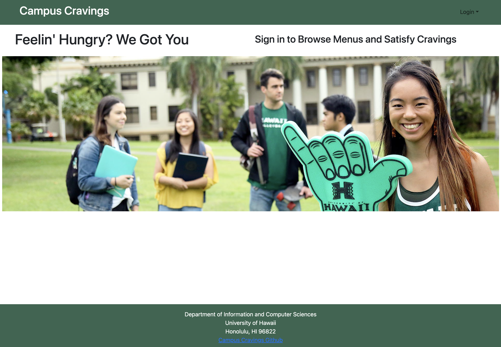

<h3>Overview</h3>
Campus Cravings is a database of restaurants on and near the campus of UH Manoa which will include the names, location, menus, prices, hours of operation, and payment methods of each. This database will significantly benefit UH Manoa students by providing a convenient and easily accessible resource for all things related to on-campus dining. Including accounts for eatery owners will help maintain up-to-date and accurate restaurant information, enhancing the overall dining experience on campus.

<h3>Personal Thoughts</h3>
My contributions overall project were the creation of the vendors, along with the fixing of some errors and looks of the login and signup pages. Honestly, work put into this project was a lot more than I thought it would be. Much of the time was actually spent researching and looking through documentation on how to do things. Working together in a group was also a learning experience to how everyone has to work together to understand what each other are doing.
If you want to see more into the process of the project development, here is the link to the GitHub page:
<a href="https://campuscravings.github.io/">Link</a>

